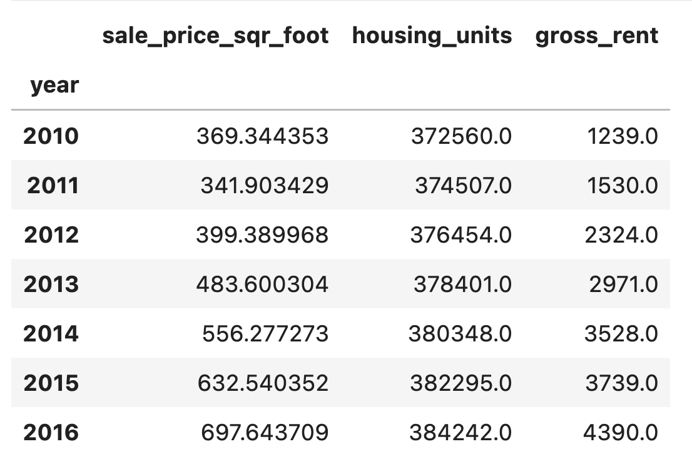
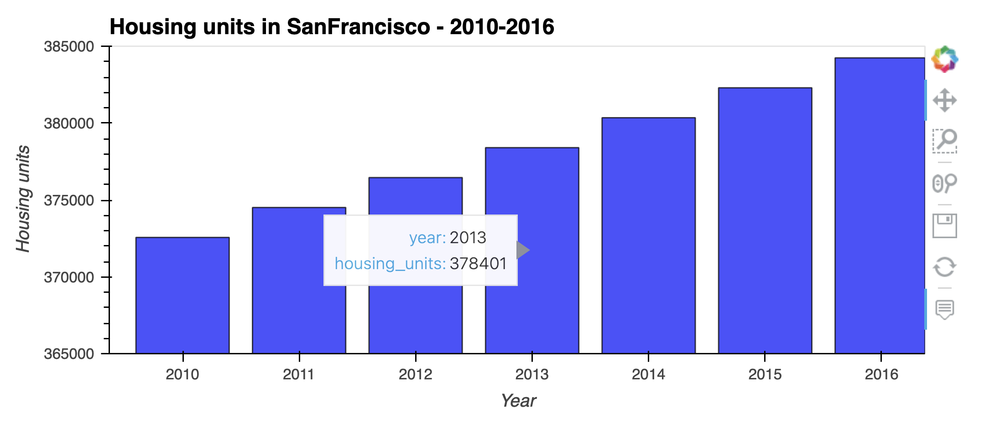
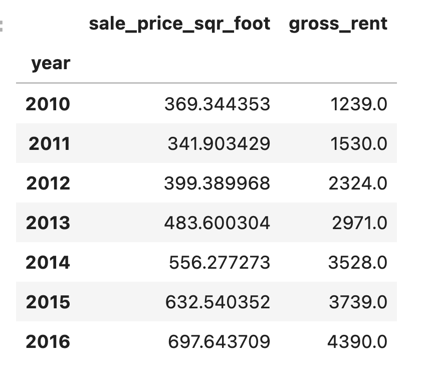
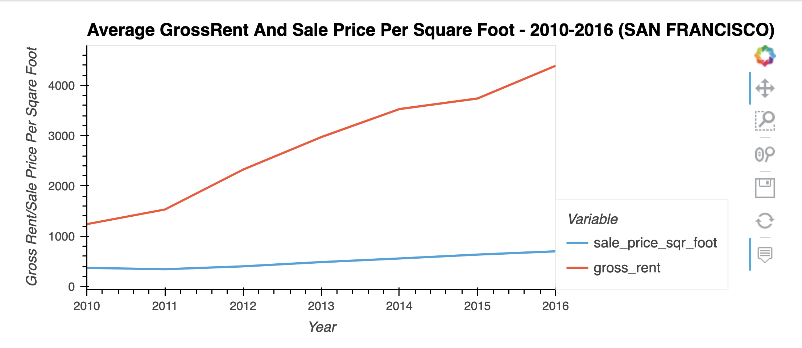
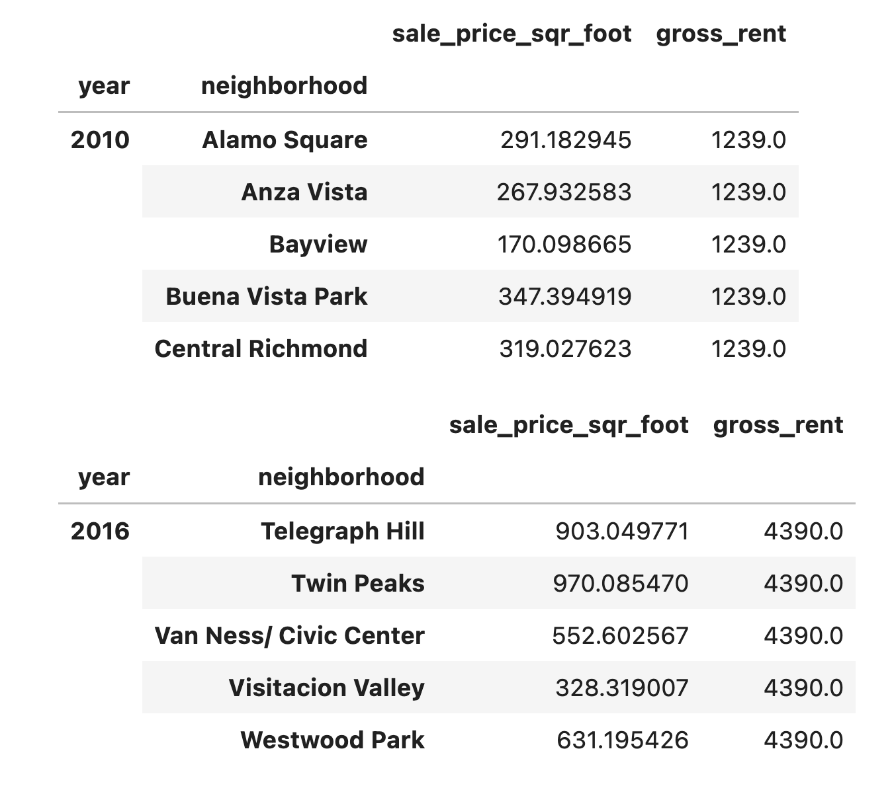
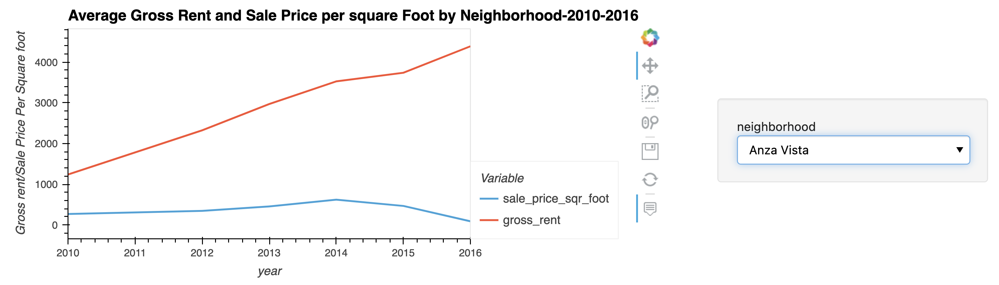
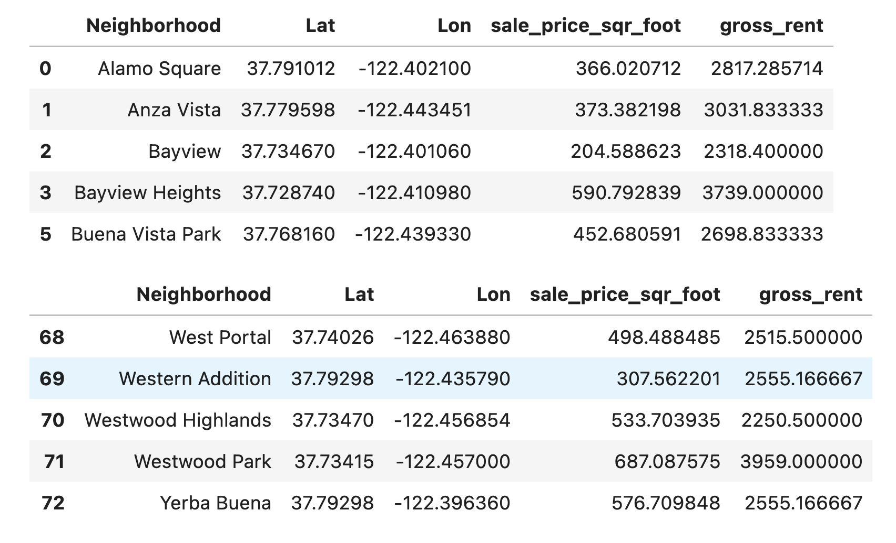
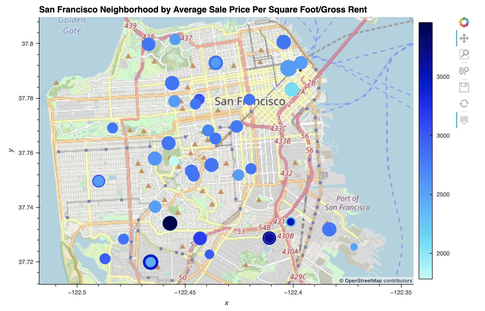

# SanFrancisco_Rental_Housing_Analysis
An analysis, to find properties in the San Francisco market that are viable investment opportunities.

This is a python enabled command line interface that represents San Francisco rental housing analysis for a Proptech company. The company wants to offer an instant, one-click service for people to buy properties and then rent them.

This analysis uses data visualizasion including aggregation, interactive visualizations, and geospatial analysis, to find properties in the San Francisco market that are viable investment opportunities and includes:

* Calculating and plotting the housing units per year.

* Calculating and plotting the average prices per square foot.

* Comparing the average prices by neighborhood.

* Building an interactive neighborhood map and

* Composing the data story.


## Technologies
This project runs on python 3.7 and includes the following libraries and dependencies:

* Pandas
* Pathlib
* hvPlot
* GeoViews
* Jupyter Notebook

## Installation Guide

To use the application you need to install the following dependencies.

```python
  pip install pathlib
  conda install -c pyviz hvplot geoviews

```

For some installations, you might get a message indicating that the requested packages are already installed. This is fine—Conda automatically installs the software dependencies that these libraries require.
Confirm the installation of all the PyViz packages by running the following commands:

```
 conda list pathlib
 conda list hvplot
 conda list geoviews
```
* Make sure to use hvPlot version 0.7.0 or later.
---

## Usage

To use this application just clone the repository and run the **jupyterlab** by running the following command on your terminal:

```jupyterlab```

Upon launching the application  on jupyter lab run the file by clicking on the play button on top of the notebook. 


## Usage Examples

***Data Aggregation by YEAR***





***Housing Units per Year***





From the visual an increasing trend in supply can be observed.The supply of houses are growing around 2000 units per year from 2010 to 2016.


***Average Sale Prices per Square Foot by Year***








A slight drop can be observed in 2011 compared to the previous year(2010) by 27.44 USD in the average sale price per sqare foot.Although there was a decrease in average sale price per sqare foot in 2011,the gross rent did'nt experience any drop compared to the previous year,rather it went up(1530.0 vs. 1239.0).


***Average Sale Prices and Average Rent by Neighborhood***






The plot tells us that for the Anza Vista neighborhood,the average sale price per square foot for 2016 is less than the price that’s listed for 2012. For 2016 the average sale price per square foot is 88.402 USD while for 2012 its 344.491 USD.


***Neighborhood Data***




***Interactive Neighborhood Map***




Based on the information that the above visualization depicts, Westwood Park has the highest yielding rental properties with the average gross rent of 3959 USD.On the other hand, Finacial district is the costliest neighborhood where properties are sold for the averge of 903.99 USD per sqare foot.

**Conclusion:**

Reviewing the plots created above, an increasing trend in rental income growth can be observed compare to the trend in sale prices during the period of 2010 -2016. Although some neighborhoods have experianced a drop in sale prices in 2011, the rental income kept accelarating steadily from 2010 to 2016 holding the true for all the neighborhoods across San Francisco.

San Francisco housing market is one of the most expensive real estate market in the world.It has become the preferred home of many due to the today’s most innovative companies and their respective employees within close proximity to Silicon Valley.Due to the exorbitant rise in house prices, it is more affordable to rent a house rather then owning one,especially for the sarters.Based on the information depicted in the visualizations, the trend for rental income growth compared to trend in sale prices across all the SanFrancisco neighborhoods shows an increasing demand for rental properties.Although the sale prices of the houses in SanFrancisco were climbing up steadily over the years, the median rent was also on the rise drastically leaving a lot of room for profit in terms of rate of returns which will attract the potential investors looking for long term passive income. One click, buy-and-rent service will definitely prove helpful to the investors looking for rental properties,hence having a lot of growth potential.

The San Francisco housing market is the most expensive market in the most expensive state.Seeing the trend, it's evident that the housing prices are not going to drop but there are still some neighborhoods that have comparatively low sale price with a potential of good rental income.As per the analysis for the investments with good return, my top three neighborhood recommendation would be:

1. Westwood highland (average sale price= 170.29 USD per sqare foot,Median rental income = 3528 USD),

2. Ocean View (average sale price= 330.10 USD per sqare foot,Median rental income = 3414 USD),and

3. Central Sunset (average sale price= 423.69 USD per sqare foot,Median rental income = 2817 USD)

___


## Contributers

Manisha Lal

07/25/2022

manisha.lal.2009@gmail.com
___


## License

copyright 2022